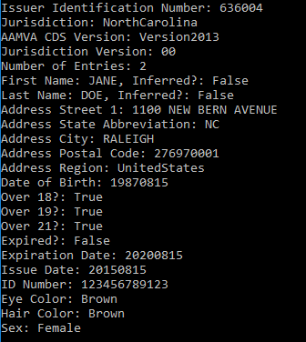

# LicenseBarcode
.NET Core Console application, using LEADTOOLS Barcode SDK, that recongizes Drivers License's PDF417 barcodes and parses the information.

The following project utilizes the LEADTOOLS Barcode libraries to recognize the PDF417 barcode within the input image. Once the barcode is recognized, the LEADTOOLS barcode engine parses the returned data and outputs the encoded data for users on the console/terminal. Fields such as AddressCity, DateOfBirth, EyeColor, etc. can be extracted and returned.

More information can be found at the links below:

Leadtools OCR SDK:
https://www.leadtools.com/sdk/barcode

#Note: must have LEADTOOLS libraries to run

